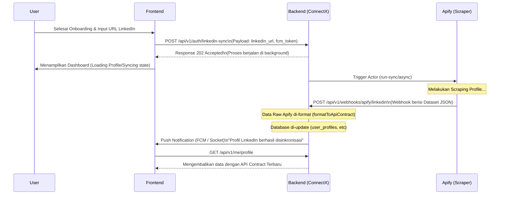

# Alur Sinkronisasi LinkedIn Pasca-Onboarding (End-to-End Flow)

Dokumen ini menjelaskan secara komprehensif alur kerja (_workflow_) ketika pengguna (User) telah selesai melakukan tahapan Onboarding di aplikasi ConnectX dan memasukkan URL LinkedIn mereka. Sistem akan secara otomatis melakukan _scraping_ secara _asynchronous_ (di latar belakang) dan mengubah data tersebut sesuai dengan standar API Contract Profile.

---

## 1. Arsitektur dan Alur Kerja Utama

Proses ini menggunakan pendekatan **Webhook-Driven Workflow** karena proses scraping profil LinkedIn memerlukan waktu tunggu (sekitar 2-5 menit). Pendekatan ini memastikan User Experience (UX) di aplikasi tetap lancar (tidak _blocking_).

### Diagram Alur (Sequence Flow)



---

## 2. Tahapan Teknis Integrasi

### Tahap 1: Pengiriman URL (Frontend ke Backend)
Saat User mengetikkan atau mem-paste link LinkedIn mereka pada halaman terakhir Onboarding, frontend harus menembak _endpoint_ inisiasi:
* **Endpoint:** `POST /api/v1/auth/linkedin-sync`
* **Headers:** `Authorization: Bearer <token>`
* **Payload:**
```json
{
  "linkedin_url": "https://www.linkedin.com/in/username",
  "fcm_token": "token_device_untuk_notifikasi",
  "device_id": "device_identifier"
}
```

### Tahap 2: Proses Scraping (Apify)
Backend akan memanggil layanan Apify untuk memulai proses scraping URL tersebut. Karena proses ini _asynchronous_, Backend akan mengembalikan respons HTTP `202 Accepted` ke Frontend agar User dapat langsung masuk ke Dashboard App.

### Tahap 3: Webhook & Data Formatting (API Contract Mapping)
Ketika Apify selesai menarik data (seperti contoh pada file `scraper-[tanggal].json`), Apify akan memanggil _webhook_ Backend:
* **Endpoint Webhook:** `POST /api/v1/webhooks/apify/linkedin`

Di sinilah **fungsi pemformatan (Data Mapper)** bekerja. Data _raw_ yang didapat (misalnya Array of Objects dari Apify) akan diformat menggunakan fungsi setara `formatToApiContract` yang akan mengubahnya menjadi struktur `MyProfileResponse`. 

*Mapping Utama yang Terjadi:*
1. **Nama Lengkap:** Menggabungkan `firstName` + `lastName`.
2. **Lokasi:** Mengambil teks `location.linkedinText` menjadi `location.display`, serta di-_breakdown_ menjadi `city` dan `country`.
3. **About Section:** Mengambil `about` dan menjadikannya sebagai `sections.about.value` dengan _kind_ `personalDescription` atau `startupIdea`.
4. **Skills:** `profile.skills` di-_extract_ id dan namanya untuk mengisi `sections.skills.items`.
5. **Highlights:** Mengambil Experience (`companyName`, `position`) dan Education (`degree`, `schoolName`) terbaru untuk mengisi `sections.highlights.items`.

### Tahap 4: Update Database & Notifikasi
Setelah data di-_mapping_, _Job Processor_ di Backend (`ProcessLinkedInProfileJob`) akan melakukan operasi ke tabel `user_profiles`, tabel `tags` (untuk relasi skills/hobbies), dll.
Setelah proses _database_ selesai, Backend mengirimkan Push Notification menggunakan _fcm_token_ yang diterima pada tahap 1 untuk memberi tahu User bahwa profil ConnectX mereka telah ter-update secara otomatis sesuai dengan CV LinkedIn mereka.

---

## 3. Hasil Akhir (GET `/api/v1/me/profile`)

Ketika sinkronisasi selesai dan Frontend melakukan pemanggilan data User, respons yang akan diterima **sama persis** dengan API Contract yang telah didefinisikan (tanpa perlu _patch_ ulang dari sisi client):

```json
{
  "success": true,
  "message": "Profile fetched successfully",
  "data": {
    "id": "usr_xxxx",
    "teamId": null,
    "profileType": "builder",
    "name": "Ananda Dimas Octavian Prasetyo",
    "headline": "💻 IT Software Engineer...",
    "photoUrl": "https://media.licdn.com/dms/image/...",
    "location": {
      "city": "Yogyakarta",
      "country": "Indonesia",
      "display": "Yogyakarta, Indonesia"
    },
    "stats": {
      "connections": 426,
      "teamsJoined": 0,
      "matches": 0
    },
    "badges": [],
    "sections": {
      "about": {
        "kind": "personalDescription",
        "title": "Description",
        "value": "Hallo everyone👋, I am Dimas Octavian Prasetyo..."
      },
      "skills": {
        "title": "Skills",
        "items": [
          { "id": "sk_1", "name": "Android Studio" },
          { "id": "sk_2", "name": "Presentation Skills" }
        ]
      },
      "highlights": {
        "items": [
          "President of the Board of Commissioners and Chairman at Codevits",
          "Engineer's degree, University of Indonesia"
        ]
      }
    },
    "createdAt": "2026-05-03T10:00:00.000Z",
    "updatedAt": "2026-05-03T10:00:00.000Z"
  }
}
```

## Referensi Tambahan
- Untuk detail pemformatan di level _script_/_tester_, lihat: `Linkedin-Scraper/index.js`
- Untuk standar kontrak struktur JSON, lihat: `API-PROFILE-LINKEDIN.md`
- Untuk penjelasan lebih teknis tentang webhooks, lihat: `IMPLEMENTASI-PROFILE-DAN-LINKEDIN.md`
